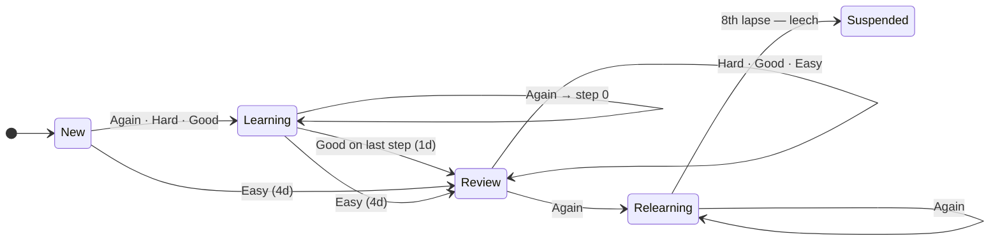

# Sentence Mining Blueprint

**FlashAI · revised project plan — supersedes the initial draft**

The first draft built flashcards around **words**. This one builds them around **sentences and images**, which is both what you asked for and what actually teaches a language. Here is the design that follows from that, and everything it changes.

| # | Section |
|---|---|
| 01 | [The method](#01--the-method) |
| 02 | [One sentence, three questions](#02--one-sentence-three-questions) |
| 03 | [Data model](#03--data-model) |
| 04 | [The scheduler](#04--the-scheduler) |
| 05 | [Session rules](#05--session-rules) |
| 06 | [Generation pipeline](#06--generation-pipeline) |
| 07 | [Media without a card](#07--media-without-a-card) |
| 08 | [Screens](#08--screens) |
| 09 | [What already exists](#09--what-already-exists) |
| 10 | [Build order](#10--build-order) |
| 11 | [The compose step](#11--the-compose-step) |
| 12 | [Tapping a word to hear it](#12--tapping-a-word-to-hear-it) |

---

## 01 · The method

### A word on its own has nothing to hold on to

Every design decision below comes out of one choice: the unit you study is a *sentence*, and its meaning is carried by an *image* rather than a translation.

`borrow → pedir prestado` is a fact about two dictionaries. It tells you nothing about how the word behaves. Is it *borrow from* or *borrow to*? Does it work for money, for time, for ideas? What tense do people actually say it in?

*"She borrowed my umbrella yesterday"* answers all of that at once, and gives your memory a scene to attach to instead of an abstraction. That is the whole argument for sentences.

#### Why the image matters more than it looks

When the back of a card says *pedir prestado*, you are not learning English. You are learning a lookup table from English to Spanish, and every time you use the word in real life you pay the cost of that translation step. Show a picture of someone handing over an umbrella in the rain and the English form attaches straight to the meaning, with no Spanish in the middle.

That is the single reason this app is worth building rather than using a word list: **the image is the definition**. Translation becomes an optional hint, not the answer.

> **The one rule that governs the rest**
>
> Each sentence should contain exactly one thing you do not already know. A sentence with three unknown words is not a flashcard, it is a reading assignment — you will fail it for reasons you cannot diagnose, and the scheduler will keep showing it to you forever.

#### Two ways material gets in

Both are worth supporting, and they cost almost the same to build because they hit the same pipeline:

- **You type a word.** The AI writes a natural sentence around it at your level. Convenient, and it is what the original plan described.
- **You paste a sentence you actually met** — in a series, a book, a conversation. The AI works out which part is the thing you are learning. This is the better habit: material you have already encountered once is material you have a reason to remember.

---

## 02 · One sentence, three questions

### The sentence is stored once; the questions are generated from it

This is the structural point that was hard to explain in chat, so here it is concretely. You add one sentence. It is stored one time, with its image and its audio. From it the app generates separate questions, and **each question carries its own schedule**.

**What you store**

> She **borrowed** my umbrella yesterday.
>
> target `borrowed` · image: someone handing over an umbrella in the rain · audio: full sentence + the word alone

**What you get asked**

| Card type | Shows | You do |
|---|---|---|
| **Cloze** — the core card | Image of the scene · `She ______ my umbrella yesterday.` · audio plays | Produce the missing word |
| **Listening** | Audio only, no text — *"What did you hear?"* | Recall the sentence; it reveals with the image. Trains the ear, which reading never does |

A third type, **production** — image plus a hint, and you say the whole sentence — is the hardest and the most valuable. It is worth adding, but not on day one: it is the one that makes sessions long.

#### Why they must be scheduled separately

Because they are different skills and you will not master them at the same time. You will recognise the sentence long before you can produce the word in it, and you will be able to read it long before you can hear it at speed. One shared interval means the easiest skill sets the pace and the other two never get practised.

#### Why the sentence is stored once

Because otherwise the image, the audio and the text exist in two or three copies, and the first time you fix a typo you fix it in one of them. They drift, and the drift is silent.

> **Recommendation**
>
> Start generating **cloze and listening** for every sentence. Add production once you have a few weeks of data and know what your daily load actually looks like. Turning it on later costs one enum value and a backfill command — no migration.

---

## 03 · Data model

### Notes hold content; cards hold questions and schedule

| Table | Holds | Rows per sentence |
|---|---|---|
| `decks` | Grouping, plus per-deck generation settings and daily limits | — |
| `notes` | The sentence, the target word, meaning, image, audio | 1 |
| `cards` | One question type + its full scheduling state | 2–3 |
| `card_reviews` | Append-only log of every grade | many |

#### notes

| Column | Notes |
|---|---|
| `sentence` | The full sentence, as studied |
| `target` | The word or chunk being learned, as it appears in the sentence |
| `target_lemma` | Dictionary form. Lets the app warn you that you already have a card for *borrow* when you add *borrowed* |
| `meaning` | Short gloss, in English or Spanish depending on the deck |
| `translation` | Full-sentence translation. Optional, and shown only after you answer |
| `pronunciation` | IPA or a plain-language note |
| `image_path` `image_url` `image_query` `image_attribution` | The picture is downloaded and stored, because the library it now comes from forbids permanent hotlinking — see [07](#07--media-without-a-card). The original URL is kept for the credit link, and the query so a bad picture can be refetched without another AI call |
| `audio_sentence_path` `audio_target_path` | Generated once, never per review |
| `source` | Where you found it — series, book, manual. Makes review sessions feel like your own material |
| `content_status` `image_status` `audio_status` | Per-asset, not one global flag — see below |

> **Why three status columns instead of one**
>
> Three external services are involved and they fail independently — image search rate-limits far sooner than the rest, and the audio model is a preview one. A note needs to be able to say *which half* it is still waiting on, and one global flag cannot; it also has to keep the half that arrived rather than throwing it away with the half that did not.
>
> **Revised, August 2026.** This section used to end "a note with text and audio but no image is perfectly studiable". That is no longer the rule. **No card is created without both its picture and its audio** — the image is the definition, which is the entire argument for this app over a word list, and a card without one teaches the English-to-Spanish lookup the design exists to avoid. A sentence whose media has not arrived is saved as a draft and waits in a tray with three ways out: retry, rewrite the scene and search again, or upload a picture of your own. `decks.require_media` turns the rule off for a deck that knowingly wants plain text. See §11.

#### cards

Thin, and carrying the schedule directly rather than in a separate table — the due query runs on every session and there is no reason to make it join.

| Column | Notes |
|---|---|
| `note_id` `type` | Unique together — one cloze card per note, one listening card per note |
| `queue` | `new` · `learning` · `review` · `relearning` · `suspended` |
| `learning_step` | Index into the learning steps array; null once graduated |
| `repetitions` `easiness` `interval_days` `next_review_at` | SM-2 state |
| `lapses` | Times failed after graduating. Drives leech detection |
| `buried_until` | Set when a sibling card of the same note was answered today |

Index on `(user_id, queue, next_review_at)` — that is the query that builds every session.

---

## 04 · The scheduler

### SM-2 with learning steps, which is what Anki actually runs

Plain SM-2 has a real gap: a brand new card jumps straight to a one-day interval. You see a sentence once, get it right by luck, and do not see it again until tomorrow — by which time it is gone. Anki fixes this with short **learning steps** inside the same session.

```
same session │ graduated — interval × easiness each time
─────────────┼──────────────────────────────────────────
  1m   10m   │   1d    3d    8d    20d   50d   4mo
```

The first two rungs happen minutes apart while you are still sitting there. Only after those does the card graduate into the day-scale ladder.

#### Four buttons, not three

The draft had Easy / Hard / Wrong. Anki uses four, and the fourth earns its place: on a card you got right, *Hard* and *Good* need to mean different things, otherwise every successful recall stretches the interval by the same multiplier regardless of how much it cost you.

| Grade | Meaning | Effect |
|---|---|---|
| **Again** | Failed. Back to relearning steps, and the card is marked as a lapse | easiness − 0.20 · interval resets |
| **Hard** | Recalled, but it hurt. Interval grows slowly | easiness − 0.15 · interval × 1.2 |
| **Good** | The normal answer. This is the button you press most | easiness unchanged · interval × easiness |
| **Easy** | Instant, no hesitation. Pushes the card far out | easiness + 0.15 · interval × easiness × 1.3 |

These fixed adjustments are Anki's variant of SM-2 rather than the original 1987 formula. With four buttons instead of a 0–5 self-rating they behave better, and they are what a decade of real use has tuned.

#### Card lifecycle



#### The details that stop it going wrong

- **Fuzz.** Every interval is jittered ±5%. Without it, everything added on the same day comes due on the same day, forever, and your load arrives in spikes.
- **Maximum interval.** Cap at a year. Beyond that the scheduling is guesswork and you would rather see the card.
- **Leeches.** A card failed 8 times is not being learned — the sentence is bad or has more than one unknown in it. Suspend it and tell the user, instead of grinding on it daily.
- **Day boundary.** Cards fall due at the start of a review day with a 4am rollover, not N×24h after the last review. Already built and tested.

All of it lives in `config/flashai.php` — steps, multipliers, caps, leech threshold — so tuning does not mean editing the algorithm.

---

## 05 · Session rules

### The part that decides whether you keep using it

> **Read this one before setting any limits**
>
> A new card generates roughly **10 reviews over its first months**. At two cards per sentence, adding 10 sentences a day settles at around **200 reviews a day** — well over half an hour, every day, forever. This is how people quit. Start at **5 new sentences a day** and raise it only once you have lived with the load.

So the app enforces limits rather than offering them:

- **New per day**, per deck. Default 5 sentences. The cap is on sentences, not cards, because sentences are what you think in.
- **Reviews per day.** A ceiling so a holiday backlog does not present you with 600 cards and no way in.
- **Sibling burying.** Answer the cloze for a sentence and its listening card moves to tomorrow. Otherwise the second one is free — you just read the answer.
- **Order within a session:** learning cards that are due now first, since they are time-sensitive, then reviews, then new cards. Never new cards first — that front-loads the hardest work.
- **Undo.** A mis-tap on *Easy* pushes a card out by weeks. The review log makes undo a matter of reverting one row.

---

## 06 · Generation pipeline

### Three services, each allowed to fail on its own

1. **Gemini writes the note.** Given a word or a pasted sentence, it returns the sentence, the target and its lemma, a gloss, IPA, an optional translation — and an `image_query`.
2. **A stock library fetches the image.** Searched on the AI's `image_query`, never on the word itself. Pixabay first, then Openverse, then Unsplash — see [07](#07--media-without-a-card) for why there are three.
3. **Gemini records the audio.** Full sentence and target word, generated once and stored, never per review. Same API key and same endpoint as step 1.
4. **You approve before it is saved.** The generated note is shown for editing first. AI sentences are usually good and occasionally strange, and a bad sentence poisons months of reviews.

> **The detail that makes or breaks the images**
>
> Searching a stock library for `borrowed` returns photos of handshakes and loan paperwork. Searching for `umbrella rain street` returns the scene in the sentence. That is why Gemini is asked for a search query describing the *scene* — a picture that illustrates the sentence is worth having, one that vaguely gestures at the word is worse than none.
>
> Keep that query to two or three concrete nouns. Stock search engines match on tags, not on meaning, and a long descriptive phrase narrows the result set to nothing rather than describing it more precisely.

#### Talking to Gemini properly

The draft's prompt ended with *"only JSON, no markdown"*. That is a request, and models decline it often enough to matter. The Interactions API takes a `response_format` with a JSON Schema and then returns schema-valid JSON as a structural guarantee. Use it — it removes a whole class of parse failures.

> **Checked in August 2026, not assumed**
>
> The draft named `gemini-2.0-flash`, which has since been shut down. The current line runs from `gemini-3.6-flash` down to `gemini-3.5-flash-lite`, which is what this uses — filling in six fields about one sentence asks nothing more of a model. `generateContent` still works but Google now points new work at `/v1beta/interactions`, where the model travels in the body and the answer arrives in a `steps` array. Model names and endpoints move; check them before writing the client, not after.

#### Limits and reuse

- None of the three services bills a card, and at five sentences a day none of their free limits is anywhere near close. The rate-limited image queue stays anyway: it costs almost nothing and it is what turns a provider having a bad afternoon into a note that waits rather than a note that fails.
- Generation results are cached by input hash, so re-adding a word you already looked up costs nothing.
- Every external call is behind an interface with a fake, so tests never touch the network.

---

## 07 · Media without a card

### The blocker was never the price

Google Cloud Text-to-Speech gives away 4 million characters a month, and one person writing five sentences a day would need about forty years to spend it. It still cannot be used here, and the reason is worth stating precisely because it changes what the alternatives have to be.

Google Cloud will not enable the API at all without a billing account with a live card attached to it. The free tier is real, but it sits behind that door. For a personal project that is not a cost decision, it is a decision about not handing a card to a metered service in exchange for audio clips of the word *umbrella*.

> **The constraint that decides everything below**
>
> This app runs on hosting we do not administer. Nothing in the pipeline may depend on a binary installed next to it. That rules out the otherwise obvious answer — a local neural engine such as Piper or Kokoro, which is free forever, has no key and no quota, and would be the recommendation on a machine we owned. **Every service here has to be something reachable over HTTP with an API key.**

### Audio: the key we already have

The Gemini Developer API carries text-to-speech on the same free tier as text generation, through **the same endpoint the sentence generator already calls**. No second account, no Cloud project, no card. `POST /v1beta/interactions` with `response_format: {"type": "audio"}` and a voice in `generation_config.speech_config`; the clip comes back base64-encoded under `output_audio.data`. Thirty voices, seventy-odd languages.

That symmetry is the real argument for it. The client is the generator's shape with a different body, the key is already in `.env`, and there is one fewer credential in the project than the original plan called for.

| What changes | Consequence |
|---|---|
| Output is raw PCM, not MP3 | `audio/L16` at 24 kHz, mono, 16-bit. A 44-byte WAV header in front of it makes it playable — pure PHP, no `ffmpeg`, which matters precisely because we cannot install one |
| Files get bigger | WAV does not compress. Roughly 230 KB per note against 20 KB for MP3. On a metered bucket this stops being a footnote — see [storage](#where-the-files-actually-live) below |
| Voice replaces gender | `ssmlGender: FEMALE` becomes a named voice. It is chosen once in config and never thought about again |
| No `speakingRate` | Pace is asked for in the prompt — *"read this slowly and clearly for a language learner"* — rather than set as a number. Less precise, and closer to what was actually wanted |

> **Stated plainly, because it is the one weak point**
>
> Every Gemini TTS model is still **in preview**. Google does not publish its free-tier rate limits — they live in the AI Studio project — and a preview model can gain a price or lose a free tier without notice. This is a real risk and it is accepted deliberately: the synthesiser sits behind `SpeechSynthesizer`, so the day it stops being free costs one new class and one line in the service provider. That is what the interface was for.

### Images: three libraries, tried in order

Unsplash was never the expensive part — it is free and needs no card. It is the *narrow* part: 50 requests an hour, two spent on every picture, and raising it means an approval process personal projects do not pass. Two better libraries exist, so the sensible design is not to pick one but to fall through them.

| Order | Library | Free limit | Why it sits here |
|---|---|---|---|
| 1 | **Pixabay** | 100 / 60s | Roughly a hundred times Unsplash's ceiling, no approval to pass, and it carries illustrations and vectors as well as photographs — often the better flashcard, since a drawing of *running* has none of the background a photograph of a runner has |
| 2 | **Openverse** | no key at all | 800M+ openly licensed works aggregated from Flickr, Wikimedia and elsewhere. Anonymous requests work. This is what rescues the uncommon concept the curated libraries never stocked |
| 3 | **Unsplash** | 50 / hour | Already written, already tested. It costs nothing to leave in as the last resort |

Pexels is the obvious fourth and is deliberately left out. At 200 requests an hour it is strictly worse than Pixabay for this, and a fourth provider is a fourth key, a fourth set of terms and a fourth thing to check when a picture looks wrong.

> **This reverses a decision in section 03**
>
> The plan said images are hotlinked from the CDN and never copied. That was correct for Unsplash, whose guidelines ask for exactly that. **Pixabay forbids it** — their terms allow their URLs for displaying search results and prohibit permanent hotlinking in an app, so the picture has to be downloaded and stored like the audio already is. That means an `image_path` beside `image_url`, and `FetchNoteImage` gaining the download step it was explicitly written not to need.
>
> Which is the better design anyway, and the earlier reasoning was thin. Storing the file means a card keeps its picture when a photographer deletes an upload, and it is the difference between a PWA that works on the underground and one that shows a broken image there.

### Where the files actually live

Both assets go to **Supabase Storage**, which speaks S3 at `/storage/v1/s3`. Laravel's own `s3` driver talks to it directly — endpoint, key, secret and bucket in `.env`, nothing else. `SynthesizeNoteAudio` already writes through the `Storage` facade and `FetchNoteImage` is about to, so switching from local disk to a bucket is configuration and not code. That is worth having been careful about.

The free plan is where this gets interesting, because it is the only metered thing left in the project:

| Free-plan limit | What it means here |
|---|---|
| **1 GB file storage** | The binding constraint. Everything below is about this number |
| 5 GB storage egress / month | Not a concern. Reviews replay the same handful of files and the browser caches them; the PWA service worker removes even that |
| 500 MB database | Text rows only. Thousands of sentences will not approach it |
| Projects pause after 7 days idle | Worth knowing for a daily-habit app: a two-week holiday puts the project to sleep and it needs a manual resume before the backlog you came back for will load |

A note costs roughly **350 KB** — about 230 KB of WAV and about 120 KB for a 640px image. That is around **2,900 notes, or nineteen months** at five a day. It does not break anything now, and it is not the shape you want long term.

Three ways to spend that budget better, in the order worth trying:

1. **Transcode the audio to MP3 if the host allows a binary.** One `ffmpeg` call takes 230 KB to about 20 KB and stretches the same bucket past four years. Whether this is possible depends entirely on where this deploys — on a container platform it is one line in the image, on genuinely shared hosting it is impossible. **Worth settling before writing the synthesiser**, because it is the difference between a real fix and a workaround.
2. **Store the sentence clip and skip the isolated target word** until you know you miss it. It is a fifth of the audio for the least-used asset, and `SynthesizeNoteAudio` already treats the target clip as optional — the null path exists.
3. **Take the 640px image variant, not the full-size one.** A flashcard is displayed at a few hundred pixels wide. Storing a 1920px original is paying four times over for pixels no one sees.

None of that touches generation, which stays free in every direction: sentences, speech and image search all sit on free tiers that a single person cannot exhaust.

### Running it on Render

Two things about the free plan there decide how this is deployed, and the first one is the kind that fails silently.

**There are no free background workers.** They start at $7 a month, and every job in this pipeline is `ShouldQueue`. Deployed as-is with `QUEUE_CONNECTION=database`, notes would be saved, jobs would be written to the queue table, and nothing would ever run them — every card stuck on *Pending* forever, with no error anywhere to explain it.

The fix is not to give up the queue. It is to run the worker **inside the web service**, which is a container whose start command is ours to write: a process manager bringing up the web server and `php artisan queue:work` side by side. One free service, three processes, no change to any job. That is what `Dockerfile`, `docker/supervisord.conf` and `render.yaml` in the repository root do.

Keeping the queue rather than falling back to `sync` matters more than it looks. Everything that makes this pipeline survive a bad afternoon — the rate limiter, `release()` with backoff, retrying a 429 but not a 401 — is queue machinery. Running the work synchronously would put a Gemini call and two downloads inside the request the user is waiting on, and throw all of it away the first time a provider was slow.

**Free web services sleep after 15 minutes idle**, and cold-start in 30–60 seconds. For a daily-habit app that is mostly fine, and it is survivable here specifically because the queue is a database table: a job dispatched just before the service sleeps is still there when it wakes, and the note waits for its picture exactly as it does when a provider rate-limits. What it costs is the first visit of the day being slow.

Two smaller consequences worth setting up at the same time:

| | |
|---|---|
| `ffmpeg` in the image | One line in the Dockerfile, and the only thing standing between the WAV and the MP3. This is why the compression is worth building at all — on Render it is genuinely available |
| `MEDIA_DISK=s3` | With `AWS_ENDPOINT` pointed at `https://<project-ref>.supabase.co/storage/v1/s3`. Render's own disk is ephemeral, so this is not optional: without it every picture and clip is deleted on the next deploy |

### What this costs in code

Less than it sounds, because the interfaces for exactly this were built in step 5 and have fakes behind them already.

| Verdict | Item |
|---|---|
| **Keep** | `SpeechSynthesizer`, `ImageProvider`, `SynthesizedAudio`, `FoundImage`, `MediaFetchFailed` and both fakes — untouched. This is the swap they were designed to absorb |
| **Keep** | `SynthesizeNoteAudio` — it already writes bytes to storage and reads the extension off the result, so a `.wav` costs it nothing |
| **Add** | `GeminiTextToSpeech`, including the WAV header. `UnsplashImageProvider` gains `PixabayImageProvider` and `OpenverseImageProvider` as siblings |
| **Add** | `FallbackImageProvider` — a decorator holding the three in order, so the chain is one binding rather than branching inside a job |
| **Rework** | `FetchNoteImage` downloads and stores the picture. `notes` gains `image_path` |
| **Config** | The `public` disk becomes an `s3` disk pointed at Supabase. No call site changes — both jobs already go through the `Storage` facade |
| **Drop** | `GoogleTextToSpeech`, `GOOGLE_TTS_API_KEY`, and the assumption that `reportUsage()` is a universal obligation — it is Unsplash's alone, and stays a no-op on the other two |

Attribution survives all of it. Pixabay asks to be credited even though it does not require it, Openverse results carry per-item Creative Commons terms that do, and `FoundImage::attribution()` already stores a `source` alongside the photographer for precisely this reason.

---

## 08 · Screens

### Five, mobile first

| Screen | Job |
|---|---|
| Home | Cards due today as one big number, a start button, streak, and how many new sentences are left in today's allowance |
| Add | One big input that takes a word or a pasted sentence. Generated note shown for editing, with the image and audio previewed, before it is saved |
| Review | Image, prompt, audio autoplay, reveal, four buttons. Undo in the corner. Nothing else on screen |
| Browse | Sentences with search, filter by state, edit, suspend, delete. Leeches surfaced here |
| Stats | Activity heatmap, upcoming load forecast, true retention, cards by state |

The forecast on the stats screen matters more than it sounds: it is the thing that tells you your daily new limit is too high, three weeks before the load actually lands on you.

---

## 09 · What already exists

### Most of it survives; nothing has data in it yet

Four commits are in. Nothing is deployed and no real cards exist, so restructuring means rewriting migrations rather than migrating data — this is the cheapest moment this change will ever be.

| Verdict | Item |
|---|---|
| **Keep** | DDEV with PHP 8.4 and PostgreSQL 16, Laravel 13, Breeze auth, Tailwind v4, tests running against Postgres |
| **Keep** | `card_reviews` — the log design is right and is exactly what a future FSRS upgrade would need to train on |
| **Keep** | Day-boundary due dates with the 4am rollover, and their tests |
| **Rework** | `SpacedRepetitionService` → a scheduler with queues and learning steps. The easiness curve changes to Anki's fixed adjustments; roughly half the existing tests carry over unchanged |
| **Rework** | `cards` splits into `notes` + `cards`, and `card_progress` folds into `cards` |
| **Drop** | The three-button grade enum, and `front_text`/`back_text` as the content model |

---

## 10 · Build order

### Each step leaves something you can actually run

1. **Reshape the schema.** Notes, cards with queues, decks with per-deck settings. Factories and model tests.
2. **Scheduler with learning steps.** Queues, four grades, fuzz, leeches, caps. Pure and heavily tested before anything touches it — this is the part that is expensive to get wrong quietly.
3. **Manual note entry and the review screen.** No AI yet. Type a sentence, pick the target, review it. At this point the app is already usable and the core is proven.
4. **Gemini integration.** Structured output, the approve-before-save step, caching. Now adding a sentence takes seconds.
5. **Images and audio.** The stock-library chain on the scene query with its rate-limited queue, Gemini TTS for sentence and target, both stored locally. The card becomes what it is meant to be.
6. **Session rules.** Daily limits, sibling burying, session ordering, undo.
7. **Browse and stats.** Search, edit, suspend, leech triage. Heatmap, forecast, retention.
8. **PWA.** Manifest, icons, service worker, install prompt. Last, because it wraps a finished app rather than shaping one.

> **Deliberately not in this version**
>
> Offline review with sync, Anki import/export, shared decks, speech recognition, push notifications, and FSRS. The review log is being kept in a shape that lets FSRS arrive later without a migration — it needs the history this design is already recording.

---

## 11 · The compose step

### Added August 2026, and it changes what §03 and §08 promised

The app shipped with a gap big enough to hide its own premise in. Saving a sentence created its card immediately, and the picture and the audio were fetched afterwards — or not at all. Nothing checked. In practice **no audio was ever produced**: the speech client read the clip from a field the live API does not use, every test faked the same wrong shape, and the suite stayed green for weeks.

So the media stopped being an afterthought and became the gate.

| | Before | Now |
|---|---|---|
| `POST /notes` | Saves the sentence **and creates the card** | Saves the sentence as a **draft** and queues its media |
| When media arrives | The listening card quietly appears | Nothing. The screen updates and waits for a person |
| Picture chosen | `hits[0]`, unseen | Six candidates, ranked, **you pick** |
| Media fails | Card exists anyway, without them | Draft waits in a tray with three ways out |

**The screen** is `GET /notes/{note}/compose`. The sentence sits at the top, already saved and safe from anything that happens below it. Under it: the picture with a grid of candidates and a box to rewrite the scene; the audio with a player; and one button, disabled until both exist, that creates the cards.

It polls a JSON endpoint every two seconds and stops the moment nothing is expected to change on its own. Generation is not synchronous because the speech tier answers in single-digit requests a minute — measured, not assumed: `limit: 10, model: gemini-3.1-flash-tts`, with a `Please retry in 38s` — and `fastcgi_read_timeout` is 90 seconds.

#### Why choosing beats searching harder

Measured against Pixabay with three real queries, four of every five results were relevant and **the top hit was wrong twice**. Searching for the whole sentence *"She borrowed my umbrella yesterday."* leads with a Christmas dinner table; searching `umbrella rain street` leads with a night shot of Osaka that carries `rain` and `umbrella` at the end of twenty tags. Stock libraries rank by popularity, not by fit.

Two fixes came out of that, and both are in:

- **`RanksByRelevance`** scores candidates by tag overlap with the query and keeps the provider's order only as a tie-breaker. It fixes both cases above without an extra request or a model.
- **`ImageQuery`** never searches the raw sentence. The scene from the generator if there is one; otherwise the target plus two content words, grammar stripped.

Ranking improves which picture is chosen *for* you. It cannot make "exact" mean anything, because exact is a judgement — hence the grid, the rewrite box, and the upload.

#### Nothing is ever a dead end

The sentence you typed is saved before any external service is called, and no failure below can take it back. A draft that never got its media shows in **Sentences → Unfinished** with a count in the tab, and from there: retry the half that failed, rewrite the scene and search again, or upload your own picture — resized to 640px with the ffmpeg that is already in the image for the audio.

---

## 12 · Tapping a word to hear it

### Both are built

Two ways to let someone tap any word in a sentence and hear it. Both were tried against the live services; the numbers below are measured, not estimated.

**A · One clip per word, cached.** Tap `coffee`, synthesise `coffee`, play it. About **10 neurons** for a seven-letter word, and paid **once ever** — the same word recurs across every card that contains it, so a stored clip keyed by word, language and voice is reused indefinitely. Gives the citation form: clean, isolated, dictionary-like. The app already does exactly this for the target word (`audio_target_path`); extending it to any word is the same code with a different key.

**B · Slice the sentence clip that already exists.** Cloudflare's Whisper returns per-word timings for audio we already generated, at **1.83 neurons per note, once**:

| Word | Start | End |
|---|---|---|
| The | 0.00s | 0.30s |
| waiter | 0.30s | 0.52s |
| spilled | 0.52s | 0.88s |
| coffee | 0.88s | 1.24s |

Store the timings on the note and tapping a word costs **nothing and waits for nothing** — `audio.currentTime = 0.52`, stop at `0.88`. No files are cut. And the word sounds the way it is actually said *in that sentence*, with the elisions and stress of connected speech, which is a different and often more useful thing to learn than the isolated form.

> **The catch, found by running it — and the fix, also found by running it**
>
> Whisper transcribed *"tablecloth"* as *"table cup"*: eight words where the sentence has seven. Mapped by position, tapping *tablecloth* would have played the sound of *cup* — a card teaching a pronunciation that is simply wrong, which is worse than no feature at all.
>
> Passing the sentence as `initial_prompt` fixes it outright. Measured on the same clip: **8 words without it, 7 with it**, transcribed exactly. `AlignWordTimings` then checks the transcript against the sentence word for word and **throws away the whole set** on any disagreement — wrong count, wrong word, timings that run backwards or overlap. There is no partial acceptance. An empty result simply falls back to A, which always works.

**Both, eventually.** A short tap plays the slice; the isolated clip is the fallback when alignment failed or the citation form is what is wanted.

> **What is in**
>
> Both, end to end. Tapping a word plays that stretch of the sentence clip — verified in the browser on the word *spilled*: it seeks the existing `9-sentence.mp3` to 0.52s, stops at the end of the word, and makes **no network request at all**. `TimeNoteWords` runs after the audio is stored and is best effort by construction: a failed or disagreeing transcript leaves the clip, the note and the card exactly as they were, with no timings and the per-word path taking over.
>
> Approach A, also end to end: `SpeakWord` stores by word, language and voice, `POST /speak` serves it, and `<x-spoken-sentence>` renders every word of a revealed sentence as something tappable. Measured in the browser: **1,026 ms** the first time a word is asked for, **45 ms** every time after. The voice is part of the storage key, so changing it never leaves a learner hearing the sentence in one voice and its words in another.
>
> The rule that governs where it may appear: **only after the answer is revealed**. A tappable word in the blanked prompt would read the answer aloud, which is the one thing a flashcard must not do. There is a test asserting the prompt is plain text.

> **Worth weighing before building it**
>
> Tapping every word is absorbing in a way that works against the session limits in [05](#05--session-rules). A ten-minute review becomes forty, and the daily cap that exists to keep this sustainable stops meaning anything. Whatever this becomes, it should not turn a review into a reading session.
